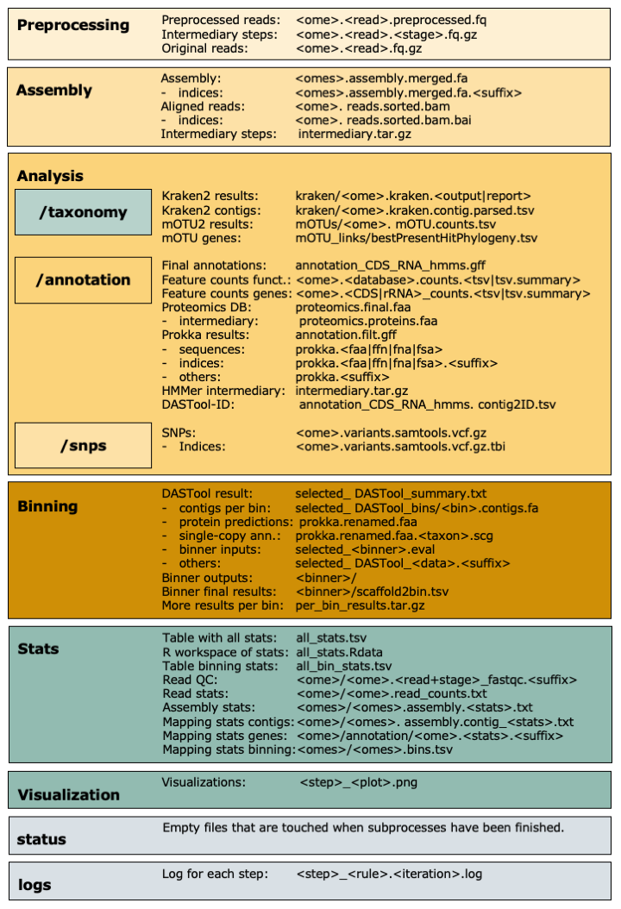

.. _output:

=======================
Overview of IMP3 output 
=======================

.. toctree::
   :maxdepth: 1
   :caption: Overview of IMP3's output
   :hidden:
   :name: output_IMP3

   Report
   Stats
   Preprocessing
   Assembly
   Analysis
   Taxonomy
   Binning
   Logs

While running, IMP3 will write the intermediary output and final results into the user-defined **output directory** (``outputdir``, see :ref:`configuration <configuration>`). 
Before finishing, IMP3 will compress some of the intermediary steps to reduce space. Finally, the IMP3 workflow will generate 
summaries and visualizations (see :ref:`configuration <configuration>` if defined).

An overview of the all outputs, files and their directory structure is given below:

	
The user can run :ref:`reporting <run_report>` to get more information on the run, together with the visualizations in HTML format. All outputs are explained in more detail in the next sections.

