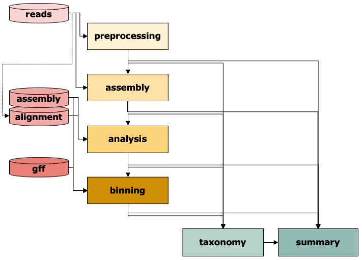

.. _steps_overview:

======================
Overview of IMP3 steps
======================

.. toctree::
   :maxdepth: 1
   :caption: Overview of IMP3 steps
   :hidden:
   :name: steps_IMP3

   Preprocessing
   Assembly
   Analysis
   Binning
   Taxonomy
   Summary

The IMP3 workflow consists of six modules: :ref:`Preprocessing <step_preprocessing>` of reads
, :ref:`Assembly <step_assembly>`, :ref:`Analysis <step_analysis>` of contigs including
functional annotation, :ref:`Binning <step_binning>` of contigs, determination of :ref:`Taxonomy <step_taxonomy>` at
various levels, and :ref:`Summary <step_summary>` including visualization.
Typically, IMP3 will use raw sequencing reads as :ref:`input <input_options>` and run through the whole workflow.

Given the appropriate :ref:`input <input_options>`, most steps can be run independently. For instance, if the user has
already processed reads and wants to assemble and annotate them. The user would  then select only ``assembly`` and ``analysis`` from the :ref:`steps <steps_overview>` (and potentially ``summary``). The user can also supply directly a given assembly to annotate and bin it. 
Or an already annotated assembly just for binning etc. Just enter the appropriate :ref:`input <input_options>` data and define the ``steps`` in the :ref:`config <configuration>` file and IMP3 will take care of it.

To get an impression of all `Snakemake <https://snakemake.readthedocs.io/en/stable/>`_ steps of a run with **metaG** and **metaT** reads as input 
using **hybrid assembly**, download :download:`this file <../figures/hybrid_dag.pdf>`.

